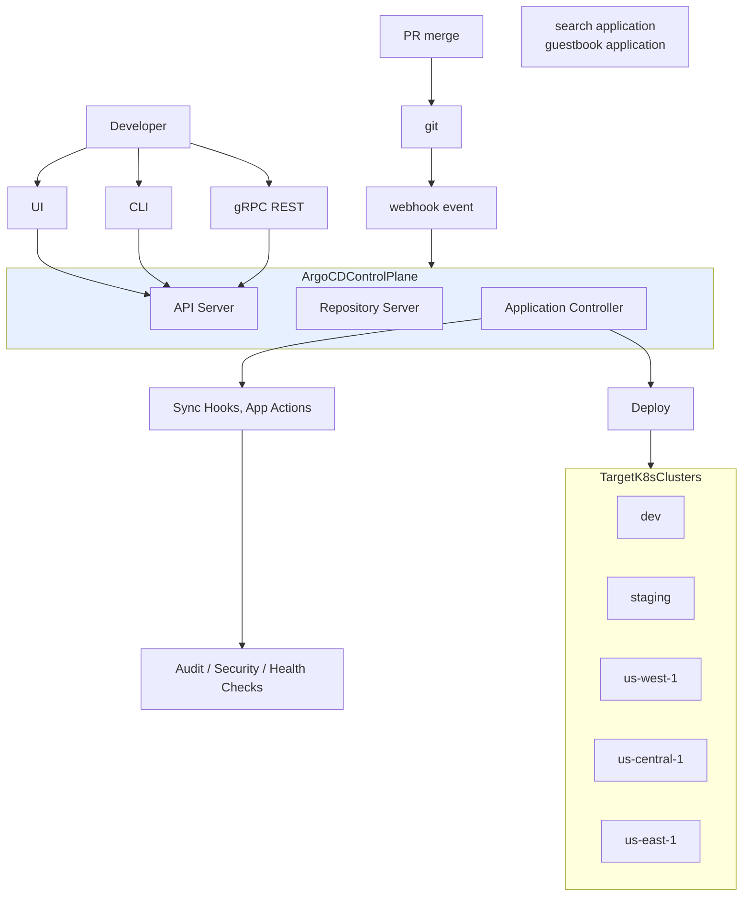
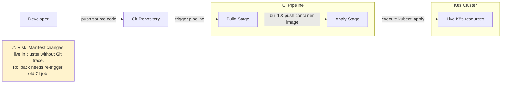
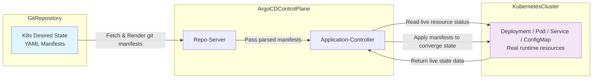

```mermaid
%%{init: {"theme":"default"}}%%
flowchart TB
%% Top Git part
   Git["git"]
   PRMerge["PR merge"]
   WebhookEvent["webhook event"]
   AppInfo["search application<br>guestbook application"]

%% Developer
   DevUser["Developer"]
   UI["UI"]
   CLI["CLI"]
   GRPCREST["gRPC REST"]

%% ArgoCD control plane
   subgraph ArgoCDControlPlane
      APIServer["API Server"]
      RepoServer["Repository Server"]
      AppController["Application Controller"]
   end

%% Bottom flow
   SyncHooks["Sync Hooks, App Actions"]
   Deploy["Deploy"]
   HooksIcons["Audit / Security / Health Checks"]

%% Target K8s clusters
   subgraph TargetK8sClusters
      Dev["dev"]
      Staging["staging"]
      UsWest1["us-west-1"]
      UsCentral1["us-central-1"]
      UsEast1["us-east-1"]
   end

%% Connections
   PRMerge --> Git
   Git --> WebhookEvent
   WebhookEvent --> ArgoCDControlPlane

   DevUser --> UI
   DevUser --> CLI
   UI --> APIServer
   CLI --> APIServer

   DevUser --> GRPCREST
   GRPCREST --> APIServer

   AppController --> SyncHooks
   SyncHooks --> HooksIcons

   AppController --> Deploy
   Deploy --> TargetK8sClusters

%% Styling
   style ArgoCDControlPlane fill:#e6f0ff
```

```mermaid
%%{init: {"theme":"default"}}%%
flowchart LR
   Dev["Developer"]
   GitRepo["Git Repository"]

   subgraph CI Pipeline
      BuildStage["Build Stage"]
      ApplyStage["Apply Stage"]
   end

   subgraph K8s Cluster
      LiveResources["Live K8s resources"]
   end

%% Connections
   Dev -- push source code --> GitRepo
   GitRepo -- trigger pipeline --> BuildStage
   BuildStage -- build & push container image --> ApplyStage
   ApplyStage -- execute kubectl apply --> LiveResources
   note["⚠️ Risk: Manifest changes live in cluster without Git trace.<br/>Rollback needs re-trigger old CI job."]
   style note fill: #fff3cd
```

```mermaid
%%{init: {"theme":"default"}}%%
flowchart LR
   subgraph GitRepository
      A["K8s Desired State<br>YAML Manifests"]
   end

   subgraph ArgoCDControlPlane
      B["Repo-Server"]
      C["Application-Controller"]
   end

   subgraph KubernetesCluster
      D["Deployment / Pod / Service / ConfigMap<br>Real runtime resources"]
   end

%% Connections
   A -- Fetch & Render git manifests --> B
   B -- Pass parsed manifests --> C
   C -- Read live resource status --> D
   D -- Return live state data --> C
   C -- Apply manifests to converge state --> D

   style A fill:#e1f5fe
   style D fill:#f3e5f5
```