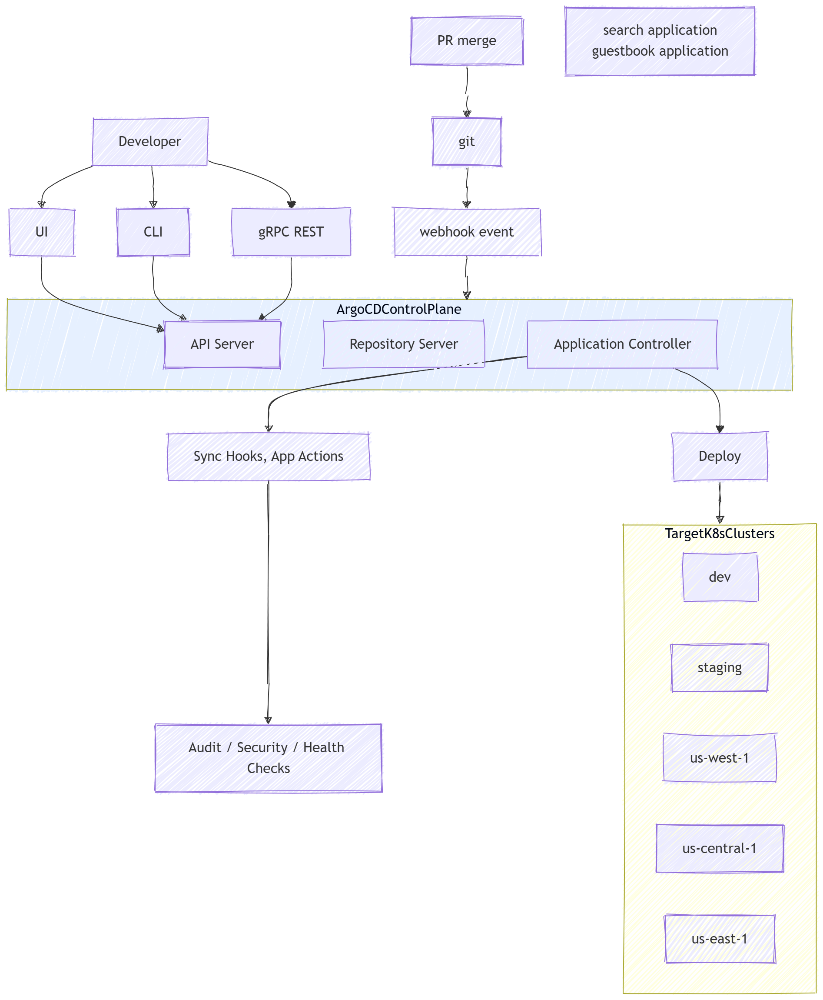
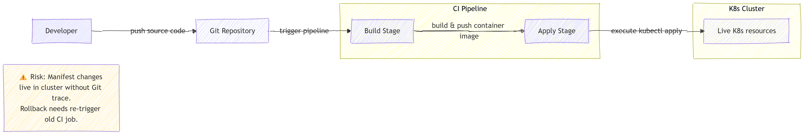

# Step1 什么是GitOps

## 知识点

1. GitOps 是面向 Kubernetes 的**持续交付方法论**。**Git 作为整套平台配置与应用清单的唯一可信源**。
2. **期望状态（Desired State）**：你期望 Kubernetes 集群达到的目标状态。全部由存放在 Git 仓库中的 YAML 清单定义，包括 Deployment、Service、ConfigMap、RBAC 权限规则，甚至 Argo-CD Application 自定义资源。
3. **实际状态（Live State）**：Kubernetes 集群内部真实运行时状态，包含实际副本数、Pod 状态、Service 端点、现存 ConfigMap 以及其他运行资源。
4. Argo-CD 核心协调循环：
   - 定期拉取 Git 仓库内容，解析期望状态清单
   - 将 Git 中的期望状态与 Kubernetes API 返回的实际状态做对比
   - 检测出差异；一旦出现不匹配，Application 资源会被标记为 `OutOfSync`（不同步）状态
   - 根据 `syncPolicy`（同步策略）配置，Argo-CD 可以自动执行同步，让集群实际状态向 Git 期望状态收敛

🖼️ 概念架构图：Argo-CD GitOps 工作流

## GitOps vs 传统命令式CI/CD

Kubernetes 的两种不同交付模式，下面为两套独立流程图进行对比。

### 📊 流程图1：传统命令式 CI/CD 工作流

>
> 特点：CI流水线持有 kubeconfig 凭证，直接操作 Kubernetes 集群。Git 仅存储业务源代码，**不作为Kubernetes资源清单的唯一可信源**。
> 

### 📊 流程图2：GitOps工作流（Argo-CD）

>
> 特点：CI仅负责构建制品。**Git存放Kubernetes期望状态清单**。由集群内部的Argo-CD完成清单下发应用。CI流水线**不持有kubeconfig凭证**。
> 

## 关键对比表：GitOps VS 传统CI/CD

| 项目 | 传统命令式流水线 | GitOps（Argo-CD） |
| --- | --- | --- |
| 可信源 | CI流水线脚本 / 本地机器 | Git仓库 |
| 清单执行者 | CI工具持有kubeconfig，直接执行`kubectl apply` | 集群内部的Argo-CD控制器执行清单下发 |
| 审计追溯 | 仅有CI任务日志 | Git提交历史 + Argo-CD同步事件记录 |
| 回滚方式 | 重新执行旧CI任务 | Git还原提交，Argo-CD自动协调生效 |

## 思考题

### 1. `OutOfSync` 是否一定代表集群故障？有哪些属于无害的 OutOfSync 场景？

参考答案

`OutOfSync` **并不代表一定发生集群故障**。该状态仅表示：Git中定义的期望状态和Kubernetes集群实际运行状态存在差异。集群上业务负载仍然可以正常健康运行。

无害/预期内的 OutOfSync 场景：

1. 开发人员使用`kubectl edit`做临时调试修改；应用本身运行正常，但产生状态漂移。
2. Kubernetes控制器自动修改集群资源（例如Deployment自动补充status字段、Service分配clusterIP、HPA修改副本数）。这些运行时自动填充的字段不存在于Git清单，会触发不同步。
3. Git已经推送新提交，但Argo-CD的Repo-Server还没完成定时Git拉取；Git期望状态已更新，集群资源仍然是旧版本。
4. 修改Git清单后没有执行同步；人为故意让集群保持旧状态一段时间。

只有当差异本身破坏业务功能时，OutOfSync才是真正故障。

### 2. 当触发Sync（同步）操作时，Argo-CD内部会发生什么？列出主要步骤。

参考答案

手动或自动触发同步后，内部主要工作流程：
1. **Repo-Server拉取并渲染资源清单**：Repo-Server拉取目标Git版本，渲染Helm / Kustomize / 原生YAML，输出最终Kubernetes资源清单（期望状态）。
2. **Application-Controller接收渲染完成的清单**。
3. **PreSync钩子执行**：带有`argocd.argoproj.io/hook: PreSync`注解的资源会被创建并运行；同步流程会等待PreSync钩子执行成功后才继续。
4. **主资源下发**：Argo-CD按照资源依赖顺序，将Deployment、Service、ConfigMap等业务主资源应用到目标Kubernetes集群。
5. **Sync钩子运行**：标记`hook:Sync`的钩子资源和主资源一同执行。
6. **Prune（裁剪）逻辑执行**：如果开启prune，集群中存在、但Git清单里已经删除的资源会被删除。
7. **PostSync钩子执行**：带有`hook: PostSync`注解的资源，在主资源同步完成之后运行。
8. **状态协调更新**：控制器更新Application自定义资源状态；全部成功则标记状态为`Synced`，同时根据集群资源实际情况更新健康状态。

如果任意钩子执行失败，根据钩子失败策略，同步流程可能会中止。

### 3. GitOps实践中为什么反复强调Git作为唯一可信源？违背该原则会带来哪些风险？

参考答案

#### Git作为唯一可信源的原因
1. **版本追踪**：Git保存每一次配置变更完整提交历史，提供「谁-何时-修改了什么」审计链路。
2. **环境可复现**：通过应用Git清单，可以在开发、测试、生产环境复现完全一致的环境。
3. **评审流程**：所有清单变更都可以走Pull Request代码评审再上线生产。
4. **声明式回滚**：还原Git提交即可完成配置回滚，不需要记忆复杂的手动CLI命令。
5. **职责分离**：Git定义期望状态；GitOps工具（Argo-CD）只负责把集群向Git定义的状态做协调。

#### 违背唯一可信源带来的风险

1. **配置漂移**：集群实际资源与Git内容不一致。Git不再反映真实环境，没人能确认什么配置才是正确。
2. **变更无审计**：运维人员直接执行`kubectl edit` / `kubectl patch`，变更不会留存在Git，无法做评审追溯。
3. **回滚困难**：无法简单通过Git还原提交恢复环境，需要人工回忆旧配置。
4. **多环境不一致**：开发、测试、生产环境逐步发生差异，“本地正常线上异常”类问题增多。
5. 如果开启Argo-CD自动同步，会意外覆盖集群上不在Git管控内的手动修改，造成配置丢失。

## 参考文档：[https://argo-cd.readthedocs.io/en/stable/](https://argo-cd.readthedocs.io/en/stable/)
