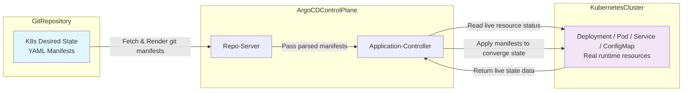

# Step1 What is GitOps

## Knowledge Points

1. GitOps is a **continuous‑delivery methodology for Kubernetes**. **Git acts as the single source‑of‑truth** for your whole platform configuration and application manifests.
2. **Desired State**: The target state you expect your Kubernetes cluster to reach. It is fully described by YAML manifests stored inside Git repository, including Deployment, Service, ConfigMap, RBAC rules, even Argo‑CD Application CR resources.
3. **Live State**: The real‑time runtime state running inside your Kubernetes cluster, including actual replica count, pod status, service endpoints, existing configmaps and other live resources.
4. Argo‑CD core reconciliation loop:
   - Periodically pull Git repository content and parse desired state manifests
   - Compare desired state (Git) against live state (Kubernetes API)
   - Detect differences; any mismatch will mark Application resource as `OutOfSync` status
   - Depending on `syncPolicy`, Argo‑CD may automatically execute sync to converge live state toward desired state in Git

🖼️ Conceptual architecture diagram：Argo‑CD GitOps Workflow

## GitOps VS Traditional Imperative CI/CD

Two different delivery modes for Kubernetes, below are independent flowcharts for comparison.

### 📊 Flowchart 1：Traditional Imperative CI/CD Workflow

>
> Feature：CI pipeline holds kubeconfig credential, directly operates Kubernetes cluster. Git only stores source code, **not the single source‑of‑truth for Kubernetes manifests**.

### 📊 Flowchart 2：GitOps Workflow (Argo‑CD)

> Feature：CI only builds artifacts. **Git stores Kubernetes desired‑state manifests**. Argo‑CD inside cluster completes manifest applying. CI does **NOT hold kubeconfig credentials**.

## Key Comparison Table：GitOps VS Traditional CI/CD

| Item | Traditional Imperative Pipeline | GitOps(Argo‑CD) |
| --- | --- | --- |
| Source of truth | CI pipeline script / local machine | Git repository |
| Who applies manifests | CI tool holds kubeconfig, executes `kubectl apply` directly | Argo‑CD controller inside cluster applies manifests |
| Audit trace | CI job logs only | Git commit history + Argo‑CD sync event records |
| Rollback way | Re‑run old CI job | Git revert commit, Argo‑CD auto‑reconcile |

## Thinking Questions

1. Does `OutOfSync` always indicate cluster failure? What are some harmless scenarios for OutOfSync?
2. What exactly happens inside Argo‑CD when you trigger a Sync operation? List the main steps.
3. Why do we emphasize Git as single‑source‑of‑truth in GitOps practice? What risks will appear if we ignore this principle?

Reference document: [https://argo-cd.readthedocs.io/en/stable/](https://argo-cd.readthedocs.io/en/stable/)

---
