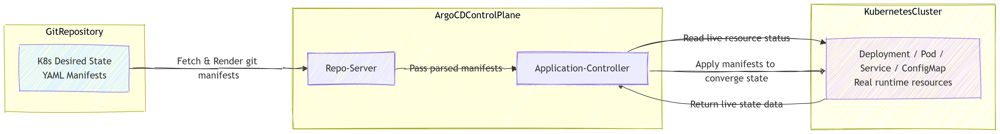

# Step1 What is GitOps

## Knowledge Points

1. GitOps is a **continuous‑delivery methodology for Kubernetes**. **Git acts as the single source‑of‑truth** for your whole platform configuration and application manifests.
2. **Desired State**: The target state you expect your Kubernetes cluster to reach. It is fully described by YAML manifests stored inside Git repository, including Deployment, Service, ConfigMap, RBAC rules, even Argo‑CD Application CR resources.
3. **Live State**: The real‑time runtime state running inside your Kubernetes cluster, including actual replica count, pod status, service endpoints, existing configmaps and other live resources.
4. Argo‑CD core reconciliation loop:
   - Periodically pull Git repository content and parse desired state manifests
   - Compare desired state (Git) against live state (Kubernetes API)
   - Detect differences; any mismatch will mark Application resource as `OutOfSync` status
   - Depending on `syncPolicy`, Argo‑CD may automatically execute sync to converge live state toward desired state in Git

[click here]({{TRAFFIC_HOST_30080}})

[click here]({{TRAFFIC_HOST1_30080}})

[click here]({{TRAFFIC_HOST2_30080}})

🖼️ Conceptual architecture diagram：Argo‑CD GitOps Workflow

## GitOps VS Traditional Imperative CI/CD

Two different delivery modes for Kubernetes, below are independent flowcharts for comparison.

### 📊 Flowchart 1：Traditional Imperative CI/CD Workflow

> Feature：CI pipeline holds kubeconfig credential, directly operates Kubernetes cluster. Git only stores source code, **not the single source‑of‑truth for Kubernetes manifests**.

### 📊 Flowchart 2：GitOps Workflow (Argo‑CD)

> Feature：CI only builds artifacts. **Git stores Kubernetes desired‑state manifests**. Argo‑CD inside cluster completes manifest applying. CI does **NOT hold kubeconfig credentials**.

## Key Comparison Table：GitOps VS Traditional CI/CD

| Item | Traditional Imperative Pipeline | GitOps(Argo‑CD) |
| --- | --- | --- |
| Source of truth | CI pipeline script / local machine | Git repository |
| Who applies manifests | CI tool holds kubeconfig, executes `kubectl apply` directly | Argo‑CD controller inside cluster applies manifests |
| Audit trace | CI job logs only | Git commit history + Argo‑CD sync event records |
| Rollback way | Re‑run old CI job | Git revert commit, Argo‑CD auto‑reconcile |

## Thinking Questions

### 1. Does `OutOfSync` always indicate cluster failure? What are some harmless scenarios for OutOfSync?

Answer

`OutOfSync` **does NOT always mean cluster failure**. This status only tells there is a difference between the desired state stored in Git and the live running state inside Kubernetes. The cluster workload can still be healthy and working normally.

Harmless / expected OutOfSync scenarios:
1. Someone manually modifies resources using `kubectl edit` for temporary debugging. The application still runs fine, but drift appears.
2. Kubernetes controllers mutate live resources automatically (e.g., Deployment adds `status` sub‑field, Service assigns `clusterIP`, HPA modifies replica count). These runtime‑added fields do not exist in Git manifests and trigger OutOfSync.
3. A new Git commit is pushed, but Argo‑CD repo‑server has not yet finished its periodic git polling. The desired state in Git has changed, while cluster resources are still old.
4. You have not triggered sync after changing Git manifests; you intentionally keep the cluster unchanged for a period of time.

Only when the difference breaks application functionality does OutOfSync become a real failure.

### 2. What exactly happens inside Argo‑CD when you trigger a Sync operation? List the main steps.

Answer

When you manually or automatically trigger Sync, the main internal workflow:
1. **Repo‑Server fetches & renders manifests**: Repo‑server pulls the target Git revision, renders Helm / Kustomize / plain‑yaml and outputs final Kubernetes manifests (desired state).
2. **Application‑Controller receives rendered manifests**.
3. **PreSync hooks execute**: Any resources annotated with `argocd.argoproj.io/hook: PreSync` are created and run; sync pauses until PreSync hooks complete successfully.
4. **Main resources apply**: Argo‑CD applies the main application Kubernetes resources (Deployment, Service, ConfigMap etc.) to the target Kubernetes cluster in correct resource order.
5. **Sync hooks run**: Resources with `hook:Sync` execute alongside main resources.
6. **Prune logic executes**: If prune is enabled, resources that exist in cluster but no longer appear in Git manifests get deleted.
7. **PostSync hooks execute**: Resources annotated with `hook: PostSync` run after main resources are synced.
8. **Status reconciliation**: Controller updates the Application CR status: set status to `Synced` if everything succeeds, mark health status based on live resource conditions.

If any hook fails, the sync may abort according to hook failure policy.

### 3. Why do we emphasize Git as single‑source‑of‑truth in GitOps practice? What risks will appear if we ignore this principle?

Answer

#### Reasons for single‑source‑of‑truth
1. **Version tracking**: Git keeps complete commit history for every configuration change, providing audit trail for who‑when‑what was modified.
2. **Reproducibility**: You can recreate exactly the same environment by applying Git manifests, for dev / staging / production.
3. **Code review workflow**: All manifest changes go through Pull Request review before reaching production.
4. **Declarative rollback**: Revert a Git commit to rollback configuration, no need to remember manual CLI commands.
5. **Separation of concerns**: Git defines desired state; GitOps tool (Argo‑CD) only takes responsibility to reconcile cluster towards Git state.

#### Risks if we ignore single‑source‑of‑truth
1. **Configuration drift**: Live cluster resources diverge from Git. Git no longer reflects real environment. Nobody knows which configuration is correct.
2. **Un‑audited changes**: People run ad‑hoc `kubectl edit` / `kubectl patch`. Changes leave no trace in Git; cannot be reviewed.
3. **Rollback becomes hard**: You cannot simply revert Git commit to restore environment; you need to manually recall previous settings.
4. **Environment inconsistency**: Dev, staging, production drift apart; “it works on my machine” problems increase.
5. Argo‑CD automated sync will overwrite manual out‑of‑Git changes unexpectedly, causing accidental loss of manual edits.

Reference document: [https://argo-cd.readthedocs.io/en/stable/](https://argo-cd.readthedocs.io/en/stable/)
